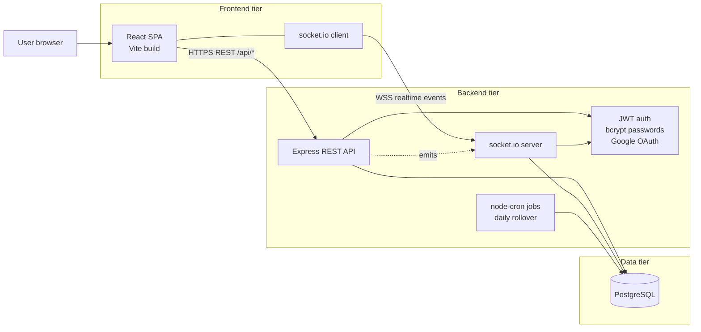
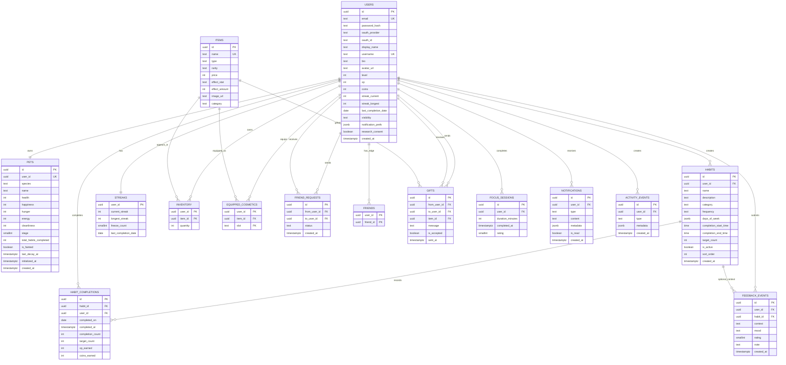
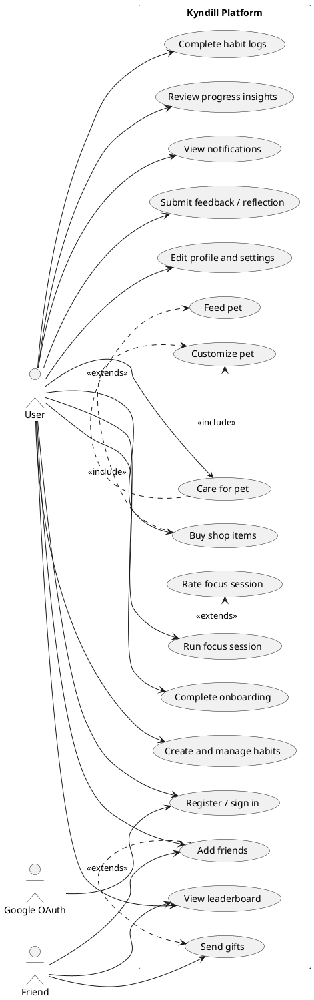
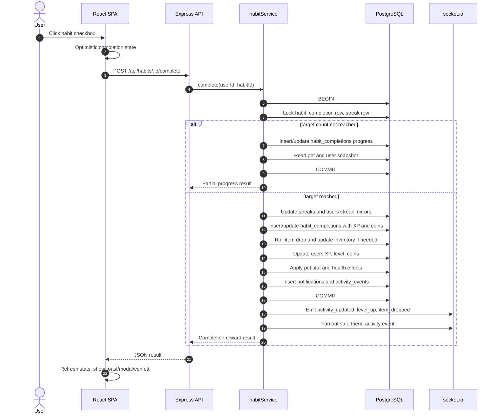
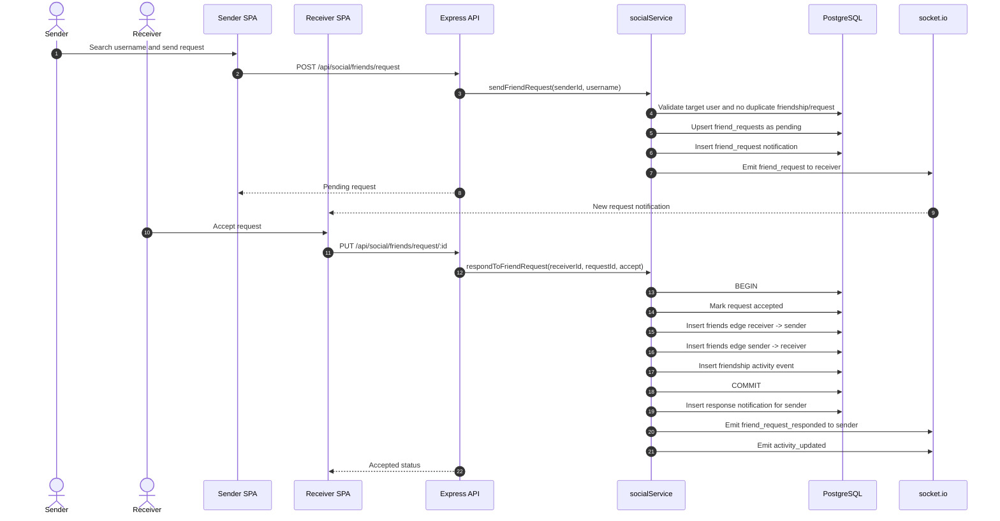
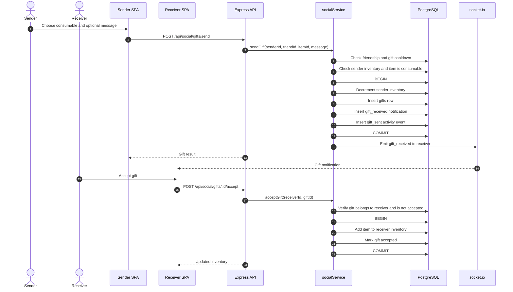
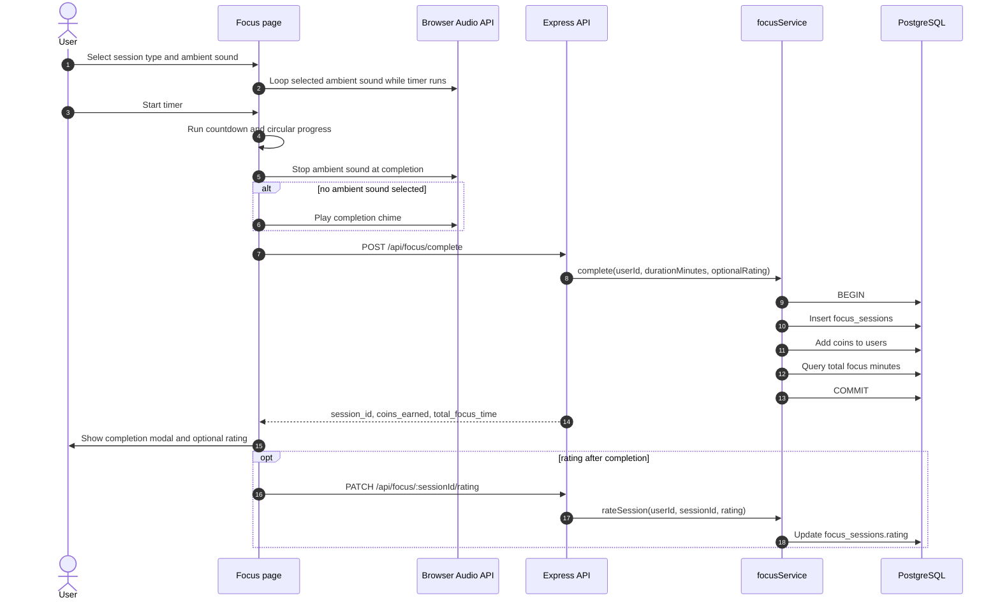
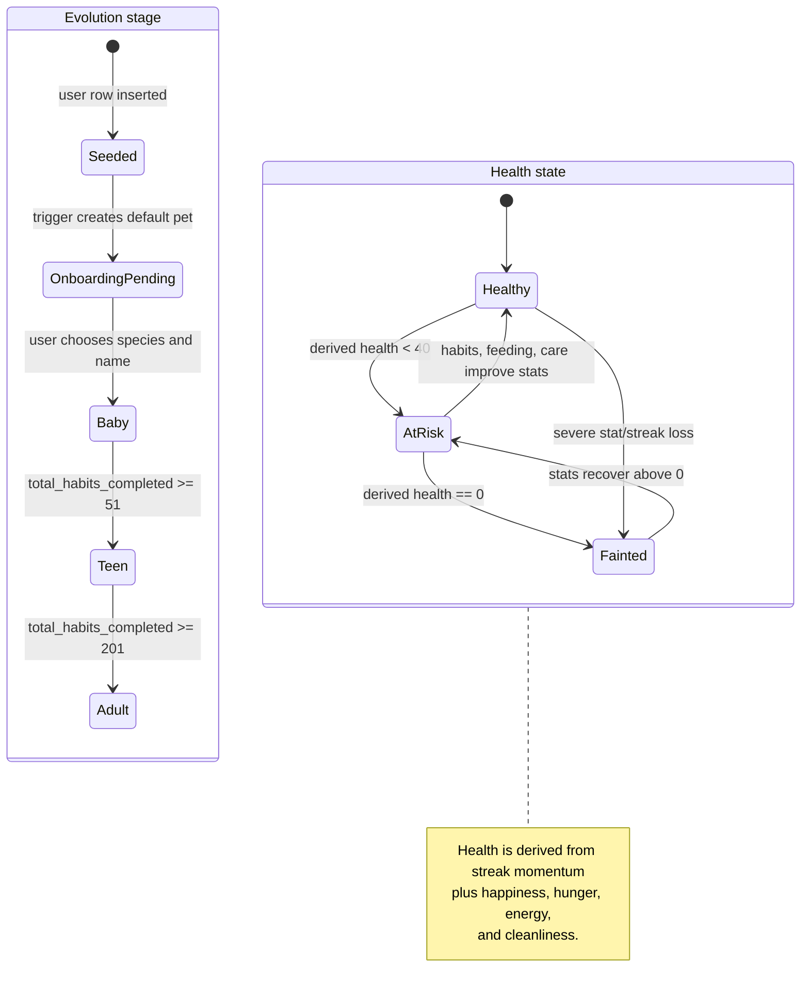
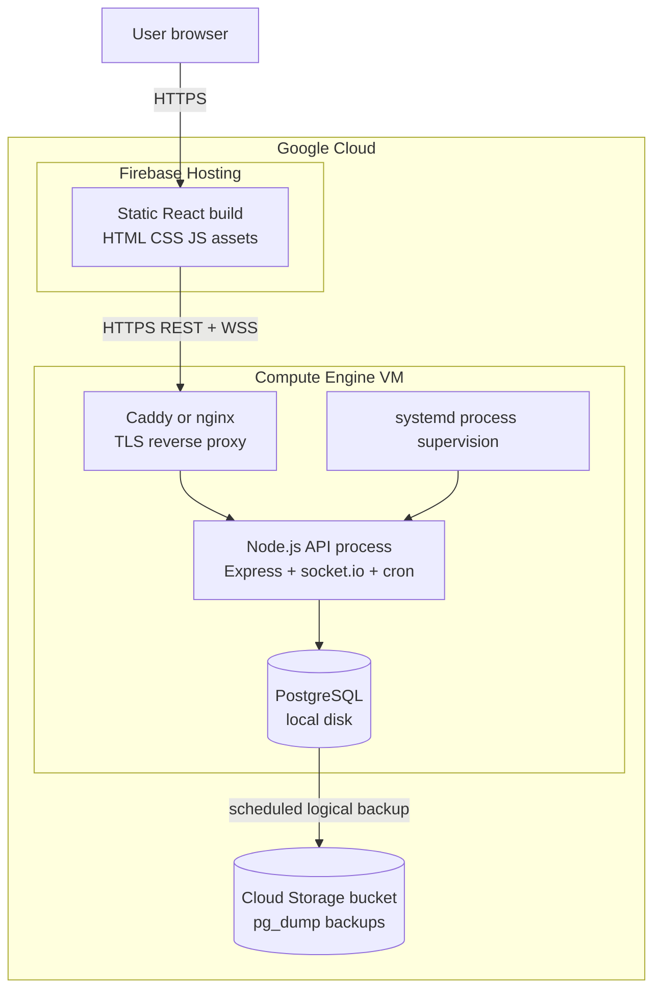

# Kyndill Diagrams

This document contains source diagrams for thesis and documentation use. Mermaid is used where it gives clean Markdown rendering. PlantUML is used for the use case diagram because it more directly matches UML use case notation.

The deployment diagram reflects the planned Google Cloud shape described in `docs/ARCHITECTURE.md`. Validate it against the final deployment configuration before submitting the thesis.

## Architecture Diagram

## Entity Relationship Diagram

## Use Case Diagram

## Habit Completion Sequence

## Friend Request And Acceptance Sequence

## Gift Send And Accept Sequence

## Focus Session Completion Sequence

## Pet State Diagram

## Planned Google Cloud Deployment Diagram

## Notes For Thesis Screenshots

- Use the architecture diagram to explain the three-tier system boundary.
- Use the ERD to justify how behavioral metrics are generated from persistent tables.
- Use the habit completion sequence to explain reward distribution, pet updates, notifications, and real-time feedback.
- Use the pet state diagram to explain non-punitive but visible companion feedback.
- If the deployed infrastructure differs from the planned Google Cloud diagram, update only the deployment section before final submission.
